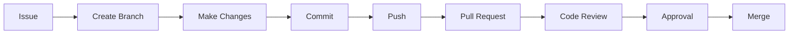
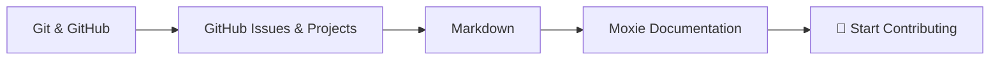
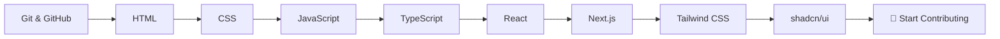
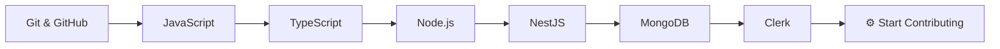
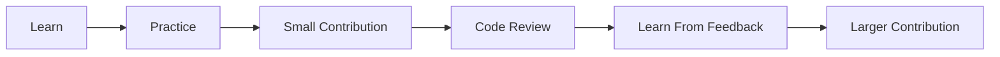

```mermaid
flowchart LR
    A[Git & GitHub] --> B[HTML]
    B --> C[CSS]
    C --> D[JavaScript]
    D --> E[TypeScript]
    E --> F[React]
    F --> G[Next.js]
    G --> H[Tailwind CSS]
    H --> I[shadcn/ui]
    I --> J[Node.js]
    J --> K[NestJS]
    K --> L[MongoDB]
    L --> M[Clerk]
    M --> N[🚀 Moxie Contributor]
```

# Getting Started with Moxie

Welcome to **Moxie** 👋

This guide is for anyone who wants to contribute to the Moxie project — including people who are completely new to programming, GitHub, or web development.

You **do not need to know everything before contributing**.

The purpose of this guide is to help you learn the skills you need step by step and eventually become comfortable contributing to the project.

---

# 🧭 How to Use This Guide

Follow the learning path from top to bottom.

Each section contains:

- 🎯 **Goal** — what you should understand
- 📺 **Watch** — a recommended video/course
- 📖 **Read** — documentation or an article
- 🧪 **Practice** — something you should actually do

> **Don't just watch tutorials. Practice each concept before moving on.**

You also don't necessarily need to complete the entire roadmap.

Choose the path that matches the type of contribution you want to make.

---

# 🗺️ Learning Roadmap

```mermaid
flowchart TD
    A[Git & GitHub] --> B[GitHub Issues & Pull Requests]
    B --> C[HTML]
    C --> D[CSS]
    D --> E[JavaScript]
    E --> F[TypeScript]
    F --> G[React]
    G --> H[Next.js]

    H --> I[Tailwind CSS]
    H --> J[shadcn/ui]

    H --> K[Node.js]
    K --> L[NestJS]
    L --> M[MongoDB]
    M --> N[Clerk]
    N --> O[🚀 Start Contributing to Moxie]
````

---

# 🟢 Phase 0 — Understand Moxie

Before learning the technology, understand what you're actually joining.

## 📖 Read

* [`README.md`](./README.md)
* [`INFO.md`](./INFO.md)
* [`CONTRIBUTING.md`](./CONTRIBUTING.md)
* [`CODE_OF_CONDUCT.md`](./CODE_OF_CONDUCT.md)

## 🎯 Understand

You should know:

* What Moxie is
* What this repository is for
* What the current project stage is
* How contributors work together
* How GitHub Issues are used
* How Pull Requests work
* Why you should not push directly to `main`

## 🧪 Practice

Open the Moxie GitHub repository and find:

* Open Issues
* Pull Requests
* Branches
* GitHub Project
* Repository documentation

You don't need to change anything yet.

---

# 🟢 Phase 1 — Git & GitHub

## 🎯 Goal

Understand how developers collaborate on the same codebase.

You should understand:

* Git
* GitHub
* Repository
* Clone
* Commit
* Branch
* Push
* Pull
* Pull Request
* Merge
* Issue

## 📺 Watch

**Git and GitHub Tutorial for Beginners — Apna College**

[https://www.youtube.com/watch?v=Ez8F0nW6S-w](https://www.youtube.com/watch?v=Ez8F0nW6S-w)

## 📖 Read

**GeeksforGeeks — Ultimate Guide to Git & GitHub**

[https://www.geeksforgeeks.org/blogs/ultimate-guide-git-github/](https://www.geeksforgeeks.org/blogs/ultimate-guide-git-github/)

## 📖 Official Documentation

**GitHub — Hello World**

[https://docs.github.com/en/get-started/start-your-journey/hello-world](https://docs.github.com/en/get-started/start-your-journey/hello-world)

This is a particularly useful beginner exercise because it introduces repositories, branches, commits and Pull Requests.

## 🧪 Practice

Create a test repository on your GitHub account.

Practice:

```bash
git clone
git status
git add
git commit
git push
git pull
git branch
git switch
```

Then:

1. Create a branch.
2. Make a small change.
3. Commit it.
4. Push the branch.
5. Open a Pull Request.
6. Merge the Pull Request.

## ✅ Ready to move on when

You can explain:

> What is the difference between Git and GitHub?

and:

> What is a branch and why do we use one?

---

# 🟢 Phase 2 — GitHub Collaboration

## 🎯 Goal

Understand how Moxie manages work.

Learn:

* Issues
* Labels
* Assignments
* Comments
* Pull Requests
* Reviews
* GitHub Projects
* Project boards

## 📖 Read

**GitHub Issues**

[https://docs.github.com/en/issues](https://docs.github.com/en/issues)

**GitHub Pull Requests**

[https://docs.github.com/en/pull-requests](https://docs.github.com/en/pull-requests)

**GitHub Projects**

[https://docs.github.com/en/issues/planning-and-tracking-with-projects](https://docs.github.com/en/issues/planning-and-tracking-with-projects)

## 🧪 Practice

Create a test issue in your own repository.

Then:

1. Assign it to yourself.
2. Create a branch.
3. Work on it.
4. Open a Pull Request.
5. Link the issue.
6. Review the Pull Request.
7. Merge it.

## 🔄 Contribution Workflow



## ✅ Ready to move on when

You understand this workflow:

```text
Issue
  ↓
Branch
  ↓
Changes
  ↓
Commit
  ↓
Push
  ↓
Pull Request
  ↓
Review
  ↓
Merge
```

---

# 🟢 Phase 3 — HTML

## 🎯 Goal

Understand how webpages are structured.

Learn:

* HTML elements
* Attributes
* Headings
* Paragraphs
* Links
* Images
* Lists
* Tables
* Forms
* Semantic HTML

## 📖 Read

**MDN — Getting Started with the Web**

[https://developer.mozilla.org/en-US/docs/Learn_web_development/Getting_started/Your_first_website](https://developer.mozilla.org/en-US/docs/Learn_web_development/Getting_started/Your_first_website)

**MDN — HTML**

[https://developer.mozilla.org/en-US/docs/Web/HTML](https://developer.mozilla.org/en-US/docs/Web/HTML)

## 🧪 Practice

Create a simple webpage containing:

* Your name
* About section
* Image
* Links
* Skills list
* Contact form

Don't worry about making it beautiful yet.

## ✅ Ready to move on when

You can create a basic webpage without copying every line from a tutorial.

---

# 🟢 Phase 4 — CSS

## 🎯 Goal

Learn how to make webpages look good and responsive.

Learn:

* Selectors
* Box model
* Colors
* Typography
* Spacing
* Flexbox
* Grid
* Positioning
* Responsive design
* Media queries

## 📖 Read

**MDN — CSS**

[https://developer.mozilla.org/en-US/docs/Web/CSS](https://developer.mozilla.org/en-US/docs/Web/CSS)

**MDN — CSS Getting Started**

[https://developer.mozilla.org/en-US/docs/Learn_web_development/Core/Styling_basics](https://developer.mozilla.org/en-US/docs/Learn_web_development/Core/Styling_basics)

## 🧪 Practice

Take your HTML page from the previous phase and create:

* Navigation bar
* Cards
* Responsive layout
* Buttons
* Mobile layout

## ✅ Ready to move on when

You understand why:

```css
display: flex;
```

and:

```css
display: grid;
```

are used and can create a responsive page.

---

# 🟢 Phase 5 — JavaScript

## 🎯 Goal

Learn programming fundamentals and browser interaction.

Learn:

* Variables
* Data types
* Conditions
* Loops
* Functions
* Arrays
* Objects
* Array methods
* DOM
* Events
* Promises
* `async/await`
* Modules

## 📖 Read

**MDN — JavaScript Guide**

[https://developer.mozilla.org/en-US/docs/Web/JavaScript/Guide](https://developer.mozilla.org/en-US/docs/Web/JavaScript/Guide)

## 🧪 Practice

Build a small project such as:

* Todo app
* Calculator
* Quiz
* Weather application
* Expense tracker

The project should use JavaScript to make the page interactive.

## Example

You should be able to understand code like:

```javascript
const events = events.filter(event => event.active);
```

and write basic asynchronous code using:

```javascript
async function getData() {
  const response = await fetch(url);
  return response.json();
}
```

## ✅ Ready to move on when

You can write basic JavaScript without depending entirely on copying code from tutorials.

---

# 🟡 Phase 6 — TypeScript

## 🎯 Goal

Learn how TypeScript adds types to JavaScript.

Learn:

* Basic types
* Interfaces
* Type aliases
* Function types
* Objects
* Arrays
* Union types
* Generics
* Type narrowing

## 📖 Read

**TypeScript Handbook**

[https://www.typescriptlang.org/docs/handbook/intro.html](https://www.typescriptlang.org/docs/handbook/intro.html)

## 🧪 Practice

Convert a small JavaScript project into TypeScript.

Create types for:

```typescript
type User = {
  name: string;
  email: string;
};
```

and use those types throughout your application.

## Example

Understand why this is useful:

```typescript
function getUser(id: string): User {
  // ...
}
```

## ✅ Ready to move on when

You understand what types provide and can comfortably read basic TypeScript code.

---

# 🟡 Phase 7 — React

## 🎯 Goal

Learn how to build interfaces using reusable components.

Learn:

* Components
* JSX
* Props
* State
* Events
* Conditional rendering
* Lists
* Forms
* Hooks
* Data sharing

## 📖 Read

**React Learn**

[https://react.dev/learn](https://react.dev/learn)

## 🧪 Practice

Build:

```text
Event Card
     ↓
Event List
     ↓
Event Details
```

Your application should allow users to:

* View events
* Open event details
* Filter events
* Interact with buttons/forms

## ✅ Ready to move on when

You understand the difference between:

```text
Props
State
Components
```

and can create reusable React components.

---

# 🟡 Phase 8 — Next.js

## 🎯 Goal

Learn the framework used by the Moxie frontend.

## 📖 Read

**Next.js — Getting Started**

[https://nextjs.org/docs/app/getting-started](https://nextjs.org/docs/app/getting-started)

**Next.js — App Router**

[https://nextjs.org/docs/app](https://nextjs.org/docs/app)

Learn:

* Routing
* Pages
* Layouts
* Navigation
* Server Components
* Client Components
* Data fetching
* Metadata

## 🧪 Practice

Build a small Next.js website containing:

```text
Home
About
Events
Contact
```

Add navigation between the pages.

## ✅ Ready to move on when

You can:

* Create a Next.js page
* Create routes
* Create layouts
* Navigate between pages
* Understand when a component needs to run on the client

---

# 🟡 Phase 9 — Tailwind CSS

## 🎯 Goal

Learn the styling system used by Moxie.

## 📖 Read

**Tailwind CSS Documentation**

[https://tailwindcss.com/docs](https://tailwindcss.com/docs)

Learn:

* Layout
* Flexbox
* Grid
* Spacing
* Typography
* Responsive design
* States
* Positioning

## 🧪 Practice

Rebuild one of your previous pages using Tailwind CSS.

## ⚠️ Important

Learn normal CSS first.

Tailwind should make styling faster — it should not replace your understanding of CSS.

---

# 🟡 Phase 10 — shadcn/ui

## 🎯 Goal

Learn how Moxie uses reusable UI components.

## 📖 Read

**shadcn/ui Documentation**

[https://ui.shadcn.com/docs](https://ui.shadcn.com/docs)

Learn how to:

* Find components
* Add components
* Read component source
* Customize components
* Combine components

## 🧪 Practice

Build a page using components such as:

* Button
* Card
* Dialog
* Input
* Select
* Dropdown
* Tabs

## ⚠️ Important

Don't blindly copy components.

Read the code and understand how they work.

---

# 🟡 Phase 11 — Node.js

## 🎯 Goal

Understand JavaScript outside the browser.

## 📖 Read

**Node.js Learn**

[https://nodejs.org/learn](https://nodejs.org/learn)

Learn:

* Node.js
* npm
* `package.json`
* Modules
* Dependencies
* Environment variables
* HTTP basics
* Running scripts

## 🧪 Practice

Create a small Node.js application that starts an HTTP server.

---

# 🔵 Phase 12 — NestJS

## 🎯 Goal

Learn how the Moxie backend is developed.

## 📖 Read

**NestJS — First Steps**

[https://docs.nestjs.com/first-steps](https://docs.nestjs.com/first-steps)

Learn:

* Modules
* Controllers
* Services
* DTOs
* Validation
* Dependency injection
* REST APIs

## 🧪 Practice

Create a simple API:

```text
GET    /events
GET    /events/:id
POST   /events
PATCH  /events/:id
DELETE /events/:id
```

You don't need to build a production application.

The goal is to understand how a NestJS API works.

---

# 🔵 Phase 13 — MongoDB

## 🎯 Goal

Understand how application data is stored.

## 📖 Read

**MongoDB Getting Started**

[https://www.mongodb.com/resources/getting-started](https://www.mongodb.com/resources/getting-started)

**MongoDB Documentation**

[https://www.mongodb.com/docs/](https://www.mongodb.com/docs/)

Learn:

* Databases
* Collections
* Documents
* Fields
* CRUD
* Queries
* Updates
* Basic indexing

## 🧪 Practice

Create a simple collection of events.

Practice:

```text
Create event
Read event
Update event
Delete event
```

Then connect the database to a small backend application.

---

# 🔵 Phase 14 — Clerk

## 🎯 Goal

Understand authentication and how Clerk is used by Moxie.

## 📖 Read

**Clerk — Next.js Quickstart**

[https://clerk.com/docs/getting-started/quickstart](https://clerk.com/docs/getting-started/quickstart)

Learn:

* Authentication
* Sign in
* Sign up
* Sessions
* User identity
* Protected resources

## 🧪 Practice

Create a small Next.js application with:

```text
Sign Up
Sign In
Profile
Sign Out
```

Then understand how an authenticated request can be handled by a backend.

---

# 🚀 Phase 15 — Become a Moxie Contributor

Congratulations — now you have the foundation needed to start working on Moxie.

But **don't immediately pick a huge issue**.

Start small.

---

## Step 1 — Read the Repository Documentation

Read:

* `README.md`
* `INFO.md`
* `CONTRIBUTING.md`
* `CODE_OF_CONDUCT.md`

---

## Step 2 — Explore GitHub

Look at:

* Issues
* Project board
* Pull Requests
* Branches
* Existing discussions

---

## Step 3 — Choose an Issue

Choose an issue appropriate for your current skill level.

If you're unsure, ask the project maintainers.

---

## Step 4 — Comment on the Issue

Tell the team that you're going to work on it.

This helps prevent multiple people from unknowingly working on the same issue.

---

## Step 5 — Create Your Branch

Follow the branch naming rules in `CONTRIBUTING.md`.

For example:

```bash
git switch main
git pull
git switch -c feature/example
```

> Always follow the actual branch naming rules defined in `CONTRIBUTING.md`.

---

## Step 6 — Do the Work

Keep your changes focused on the issue.

Avoid unrelated changes in the same Pull Request.

---

## Step 7 — Commit

Use a clear commit message.

```bash
git add .
git commit -m "Add example feature"
```

---

## Step 8 — Push

```bash
git push -u origin feature/example
```

---

## Step 9 — Open a Pull Request

Open a Pull Request on GitHub.

Make sure you:

* Link the relevant issue
* Explain what you changed
* Explain how you tested it
* Follow the Pull Request template

---

## Step 10 — Get Your Code Reviewed

Tag at least one teammate for review.

Do not merge your own Pull Request without the required approval.

Be open to feedback.

Code review is part of learning.

---

# 🎯 Which Path Should I Follow?

You don't need to learn everything.

Choose the path that matches the contribution you want to make.

---

## 📝 Research / Documentation Contributor

Learn:



You can start contributing without becoming a programmer.

---

## 🎨 Frontend Contributor

Learn:



---

## ⚙️ Backend Contributor

Learn:



---

## 🔥 Full-Stack Contributor

Learn:



---

# 💡 Don't Try to Learn Everything at Once

Moxie is a collaborative project.

You are not expected to become an expert before making your first contribution.

A good approach is:



Your first Pull Request does not need to be perfect.

**The goal is to learn, contribute, and improve together.**

---

# 📚 Quick Reference

| Technology   | Start Here                                                                                  |
| ------------ | ------------------------------------------------------------------------------------------- |
| Git & GitHub | [GitHub Hello World](https://docs.github.com/en/get-started/start-your-journey/hello-world) |
| HTML         | [MDN HTML](https://developer.mozilla.org/en-US/docs/Web/HTML)                               |
| CSS          | [MDN CSS](https://developer.mozilla.org/en-US/docs/Web/CSS)                                 |
| JavaScript   | [MDN JavaScript Guide](https://developer.mozilla.org/en-US/docs/Web/JavaScript/Guide)       |
| TypeScript   | [TypeScript Handbook](https://www.typescriptlang.org/docs/handbook/intro.html)              |
| React        | [React Learn](https://react.dev/learn)                                                      |
| Next.js      | [Next.js Docs](https://nextjs.org/docs/app/getting-started)                                 |
| Tailwind CSS | [Tailwind Docs](https://tailwindcss.com/docs)                                               |
| shadcn/ui    | [shadcn/ui Docs](https://ui.shadcn.com/docs)                                                |
| Node.js      | [Node.js Learn](https://nodejs.org/learn)                                                   |
| NestJS       | [NestJS Docs](https://docs.nestjs.com/first-steps)                                          |
| MongoDB      | [MongoDB Docs](https://www.mongodb.com/docs/)                                               |
| Clerk        | [Clerk Next.js Quickstart](https://clerk.com/docs/getting-started/quickstart)               |

---

# 🏁 Welcome to Moxie

You don't need to know everything.

Start with what you know.

Learn what you need.

Ask questions when you're stuck.

And contribute when you're ready.

**Welcome to Moxie. 🚀**

