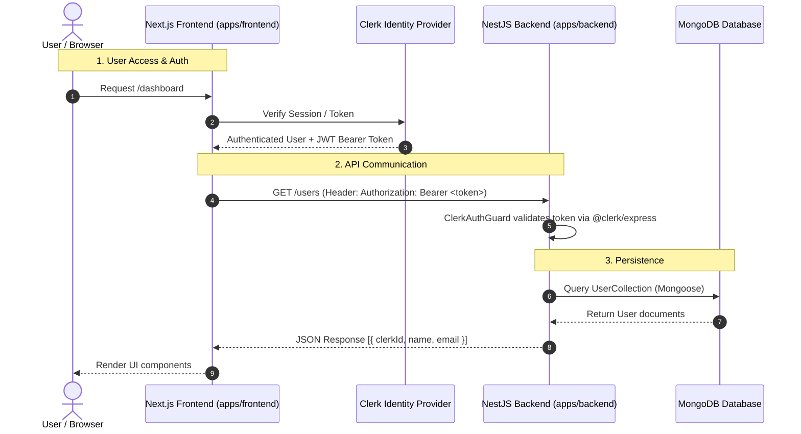

# Repository Architecture

This document details the architectural layout of the Moxie repository, explaining how packages relate to each other and how data flows through the system.

---

## Monorepo Layout

The repository is structured as a **pnpm monorepo** managed via [`pnpm-workspace.yaml`](file:///d:/PROJECTS/moxie/pnpm-workspace.yaml).

```text
MOXIE ROOT
├── .github/                 # GitHub Workflows (CI pipeline), PR templates, dependabot
├── apps/
│   ├── frontend/            # Next.js App Router frontend application
│   └── backend/             # NestJS API application
├── docs/                    # Mintlify documentation site source & Requirements
│   ├── docs.json            # Mintlify configuration
│   ├── Requirements.md      # Detailed functional requirements
│   ├── architecture/        # System design & decision docs
│   └── components/          # Frontend, Backend, DB, Auth, API docs
├── .env.example             # Shared root environment defaults
├── package.json             # Root monorepo scripts & dependencies
├── pnpm-workspace.yaml      # Workspace packages definition ("apps/*")
├── info.md                  # Comprehensive technical overview
├── GETTING_STARTED.md       # Onboarding guide & learning roadmap
└── CONTRIBUTING.md          # Git workflow & PR rules
```

---

## Component Architecture & System Data Flow

The application architecture follows a decoupled Client-Server-Database model:



---

## Data Flow Layer Roles

### 1. Frontend Layer (`apps/frontend`)
- **Technology**: Next.js (App Router), React, TypeScript, Tailwind CSS, shadcn/ui.
- **Responsibility**: Rendering UI pages (`/`, `/dashboard`, `/sign-in`, `/sign-up`), managing client-side interactive state, handling user identity via `@clerk/nextjs`, and making HTTP requests to the backend API.

### 2. Backend API Layer (`apps/backend`)
- **Technology**: NestJS, TypeScript, `@clerk/express`, Mongoose.
- **Responsibility**: REST endpoints (`/health`, `/auth/me`, `/users`), authentication enforcement via `ClerkAuthGuard`, request payload validation via `ValidationPipe`, global exception handling (`HttpExceptionFilter`), and business logic execution.

### 3. Database Layer (`MongoDB`)
- **Technology**: MongoDB document store connected via NestJS Mongoose module.
- **Responsibility**: Persistent storage of application records. Currently includes the `User` schema (`clerkId`, `name`, `email`, `createdAt`, `updatedAt`).

---

## Shared Workspace Tooling

Package orchestration is managed from root [`package.json`](file:///d:/PROJECTS/moxie/package.json) using `pnpm` workspace filters (`pnpm --filter <app>`):

- `pnpm run dev`: Concurrently executes `dev:frontend` and `dev:backend`.
- `pnpm run build`: Sequentially compiles `apps/frontend` (`next build`) and `apps/backend` (`nest build`).
- `pnpm run lint`: Runs ESLint across both frontend and backend packages.
- `pnpm run typecheck`: Runs `tsc --noEmit` across both applications.
- `pnpm run format:check`: Runs Prettier check across all source directories.

Read [Architecture Decisions](/architecture/decisions) for details on current status vs planned architectural evolution.
