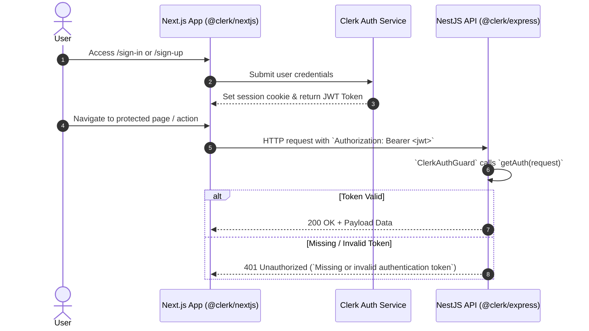

# Authentication Architecture (Clerk)

Moxie utilizes **Clerk** for authentication and identity management across both the Next.js frontend application and the NestJS backend API.

---

## Authentication Flow



---

## 1. Frontend Integration (`apps/frontend`)

The frontend imports **`@clerk/nextjs`** (v7.7.3).

### Layout Configuration (`src/app/layout.tsx`)

The root layout wraps all pages inside `<ClerkProvider>`:

```tsx
import { ClerkProvider } from '@clerk/nextjs';
import './globals.css';

export default function RootLayout({
  children,
}: {
  children: React.ReactNode;
}) {
  return (
    <ClerkProvider>
      <html lang="en">
        <body>{children}</body>
      </html>
    </ClerkProvider>
  );
}
```

### Auth Pages

- **`/sign-in`**: Renders Clerk's prebuilt `<SignIn />` widget.
- **`/sign-up`**: Renders Clerk's prebuilt `<SignUp />` widget.
- **`/dashboard`**: Protected page demonstrating authenticated session access.

---

## 2. Backend Integration (`apps/backend`)

The backend imports **`@clerk/express`** (v2.1.54) and provides a NestJS auth guard.

### `ClerkAuthGuard` (`src/auth/clerk-auth.guard.ts`)

```typescript
import {
  CanActivate,
  ExecutionContext,
  Injectable,
  UnauthorizedException,
} from '@nestjs/common';
import { getAuth } from '@clerk/express';
import { Request } from 'express';

@Injectable()
export class ClerkAuthGuard implements CanActivate {
  canActivate(context: ExecutionContext): boolean {
    const request = context.switchToHttp().getRequest<Request>();
    const { userId } = getAuth(request);

    if (!userId) {
      throw new UnauthorizedException(
        'Missing or invalid authentication token',
      );
    }

    return true;
  }
}
```

### Protecting Controllers & Routes

To protect a route in NestJS, apply `@UseGuards(ClerkAuthGuard)`:

```typescript
@Controller('users')
export class UsersController {
  constructor(private readonly usersService: UsersService) {}

  @UseGuards(ClerkAuthGuard)
  @Get()
  findAll() {
    return this.usersService.findAll();
  }
}
```

To extract the authenticated user details inside a controller handler, use `getAuth(request)`:

```typescript
@UseGuards(ClerkAuthGuard)
@Get('auth/me')
me(@Req() request: Request) {
  return { auth: getAuth(request) };
}
```

---

## Required Environment Variables

| Variable | Scope | Description |
| :--- | :--- | :--- |
| `NEXT_PUBLIC_CLERK_PUBLISHABLE_KEY` | Frontend | Public Clerk API key for frontend widget |
| `CLERK_SECRET_KEY` | Frontend & Backend | Secret key for backend API validation |
| `CLERK_PUBLISHABLE_KEY` | Backend | Backend publishable key reference |
| `CLERK_ISSUER` | Root `.env.example` | Clerk JWT issuer URL |
| `CLERK_JWKS_URL` | Root `.env.example` | Clerk JWKS key set endpoint for JWT verification |
