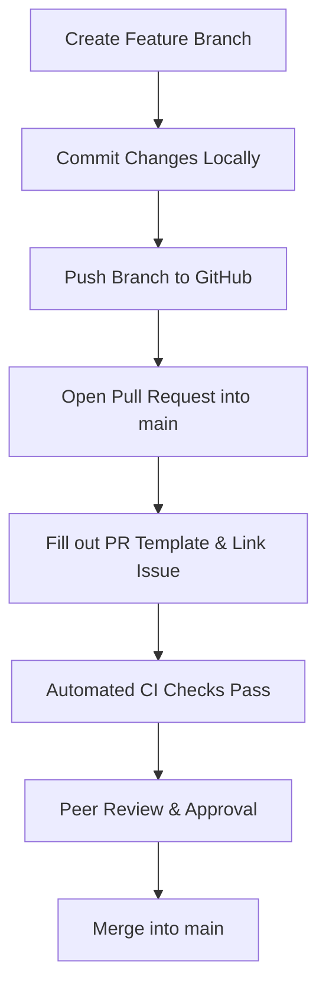

# Contribution Guidelines

Thank you for contributing to Moxie! To ensure smooth collaboration across our team, everyone must adhere to the following contribution policies.

---

## Key Contribution Rules

### 1. Main Branch Protection
`main` is protected. **Direct pushes to `main` are strictly prohibited**. All changes must go through a Pull Request (PR) and require at least **1 approval** from a teammate before merging.

### 2. Sub-Teams & Issue Tracking
- Work is organized around GitHub Issues (e.g. `#1 Requirements`, `#44 Mintlify Documentation`).
- Comment on an issue before starting work to avoid duplicated effort.
- Link PRs directly to their corresponding issue (`Closes #12` or `Relates to #44`).

---

## Branch Naming Convention

Create a new branch off `main` using the format: `<type>/<short-description>`

Allowed branch types:
- `docs/` — Documentation updates and additions
- `feature/` — New product functionality
- `fix/` — Bug fixes and resolution
- `research/` — Technical research and benchmarking
- `chore/` — Tooling, dependency, or config updates

#### Examples
- `docs/mintlify-setup`
- `feature/events-list`
- `fix/auth-redirect-loop`

---

## Commit Message Guidelines

Keep commit messages concise and descriptive of what changed:

### Good Examples
- `Add Mintlify docs.json configuration and navigation`
- `Implement ClerkAuthGuard in NestJS backend`
- `Fix MongoDB connection retry logic`

### Avoid
- `update`
- `fix stuff`
- `wip`
- `changes`

---

## Pull Request Process

1. **Push & Open PR**: Open a PR into `main` using the repository PR template.
2. **Fill Details**: Explain what was changed, link the relevant issue, and tag a teammate for review.
3. **CI Pipeline**: Ensure all CI checks (`lint`, `typecheck`, `format:check`, `build`) pass cleanly.
4. **Peer Approval**: Never merge your own PR without a review and approval.

---

## Code of Conduct

All contributors are expected to follow our [Code of Conduct](https://github.com/your-org/moxie/blob/main/CODE_OF_CONDUCT.md):
- Be respectful and constructive in comments and reviews.
- Focus feedback on the code, not the person.
- Keep discussions transparently on GitHub issues and PRs.
