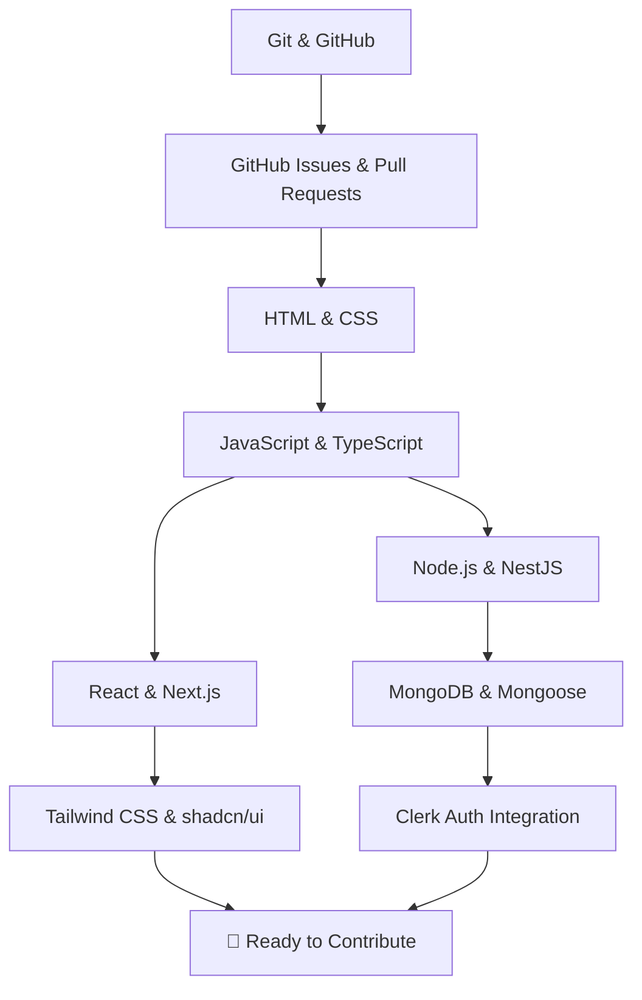

# Getting Started with Moxie

Welcome to **Moxie**! Whether you are an experienced developer or completely new to open source and web development, this guide will help you understand the skills required to contribute effectively.

You do **not** need to master every technology before making your first contribution.

---

## Contributor Mindset

- **Learn by doing**: Practice each concept with small exercises rather than watching tutorials passively.
- **Start small**: Begin with documentation updates, small UI tweaks, or bug fixes.
- **Ask questions**: If you encounter blockers, post on the relevant GitHub issue rather than making assumptions.

---

## 🗺️ Learning Roadmap

The project utilizes a modern full-stack web technologies stack. Follow the roadmap path relevant to your planned contribution area:

---

## Learning Phases Overview

### Phase 0 — Understand Moxie
Familiarize yourself with the project goals, code of conduct, and contribution policies:
- Read [Project Overview](/overview)
- Read [Requirements](/requirements)
- Read [Contribution Guidelines](/contributing)

### Phase 1 & 2 — Git & GitHub Collaboration
Understand branch workflows, pull request reviews, and issue tracking.
- Learn: `git clone`, `git branch`, `git commit`, `git push`, Pull Requests, Code Reviews.
- Rule: **Never push directly to `main`**.

### Phase 3–6 — Web Development Fundamentals
- **HTML & CSS**: Semantic page structure, Flexbox, Grid, and responsive layout principles.
- **JavaScript & TypeScript**: Asynchronous programming (`async/await`), array methods (`map`, `filter`), type definitions, and interfaces.

### Phase 7–10 — Frontend Stack
- **React**: Functional components, props, state hooks (`useState`, `useEffect`).
- **Next.js**: App Router (`src/app`), Server vs Client Components, routing, layouts.
- **Tailwind CSS & shadcn/ui**: Utility classes, Radix UI primitives, class variant authority.

### Phase 11–14 — Backend Stack
- **NestJS**: Modules, Controllers, Services, Dependency Injection, DTO validation.
- **MongoDB & Mongoose**: Collections, Documents, Schemas, CRUD operations.
- **Clerk Auth**: Session tokens, JWT verification, protected frontend/backend routes.

---

## Ready to Set Up your Local Environment?

Proceed to the [Development Setup](/development-setup) guide to install prerequisites and launch the monorepo locally.
