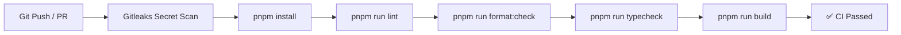

# Development Workflow

This page details the day-to-day development scripts, quality checks, and workflows used when developing features in the Moxie monorepo.

---

## Monorepo Scripts Reference

All primary development tasks are orchestrated using `pnpm` from the monorepo root:

```bash
# Concurrently launch frontend and backend development servers
pnpm run dev

# Launch frontend Next.js dev server only (http://localhost:3000)
pnpm run dev:frontend

# Launch backend NestJS dev server only (http://localhost:3001)
pnpm run dev:backend

# Compile production builds for both apps
pnpm run build

# Run ESLint across frontend and backend
pnpm run lint

# Validate Prettier code formatting
pnpm run format:check

# Check TypeScript types without compiling
pnpm run typecheck

# Run backend unit tests
pnpm run test
```

---

## Workspace Environment Management

1. **Root Configuration**: `/.env.example` contains baseline defaults for both applications.
2. **Frontend Configuration**: `/apps/frontend/.env.local` contains Next.js & Clerk publishable keys.
3. **Backend Configuration**: `/apps/backend/.env` contains NestJS port, Mongoose MongoDB URI, and Clerk secret keys.

> [!WARNING]
> Never commit `.env` or `.env.local` files to Git. The `.gitignore` file enforces this rule. Secrets must be added via host provider environment settings (e.g. Render, Vercel, GitHub Secrets).

---

## Quality & CI Standards

Every pull request must pass the automated GitHub Actions pipeline (`.github/workflows/ci.yml`).



To prevent CI failures, run the full validation suite locally before opening a Pull Request:

```bash
pnpm run lint && pnpm run typecheck && pnpm run format:check && pnpm run build
```
